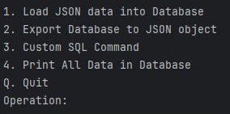

# json_converter

Converts properly formatted json file data into a sql database and can extract data searched from said database into a new json file.

- - - -

- - - -

### Requirements

[Final_Python_Project.jpg](Final_Python_Project.jpg "Final_Python_Project.jpg")

### How to Install / Run

Open folder with python IDE of choice and run main.py.
